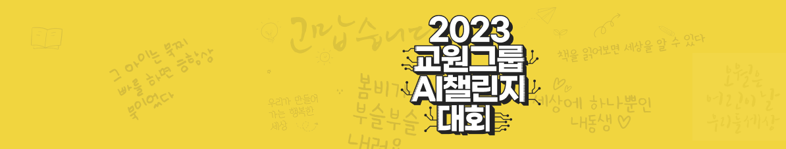

# [데이콘]2023 교원그룹 AI 챌린지 &lt;예선>

**[기간]**            
22.12.26 10:00 ~ 23.01.16 10:00          

**[배경]**     
AI가 학습에 적극적으로 활용되는 교육 시장의 흐름을 선도하고자 유아의 손글씨 인식에 최적화된 인공지능을 개발하려고 합니다.     
국내 최고의 교육 기업인 교원과 함께 빅데이터와 AI를 활용한 문제 해결에 참여해 보세요.      
  
**[주제]**    
✍손글씨 인식 AI 모델 개발       

**[설명]**    
본 예선은 참가자분들의 손글씨 인식 문제 해결 능력을 검증하여 본선 진출 팀을 선발하기 위한 과정입니다.          
본 예선은 손글씨 이미지를 바탕으로 Text Recognition을 수행하는 인식 AI 모델을 개발해야 합니다.          

**[주최 / 주관]**   
주최 : (주)교원        
주관 : 데이콘        

**[참가자격]**      
일반인, 학생 등 누구나 대회 참가 가능        

**[링크]**     
https://dacon.io/competitions/official/236042/overview/description
***

## 최종 성적(상위 5%이내(21/430))
평가방법: Accuracy 
최종 점수: 0.88577

## 데이터 분석
train 데이터를 한 글자씩 나눠서 몇 종류의 한글을 학습할 수 있는지 파악한 결과 2349개의 한글이 존재함을 알 수 있었다.(ex) "안녕" -> "안"과 "녕"이라는 두 글자를 읽을 수 있음)         

이때 2349개의 한글 데이터는 골고루 존재하지 않았다. 예를 들어 "꽈", "봔", "었" 같은 한글은 1개 밖에 존재하지 않았고 "다"는 17863개로 압도적으로 많이 존재했다.

## 사용 모델
Clovar-AI deep-text-recognition-benchmark와 baudm parseq를 사용하였고, Clovar-AI의 Pretrained 모델을 fine-tuning한 모델이 가장 좋은 성능을 보였음    

Clovar-AI deep-text-recognition-benchmark(https://github.com/clovaai/deep-text-recognition-benchmark)    
baudm parseq(https://github.com/baudm/parseq)
